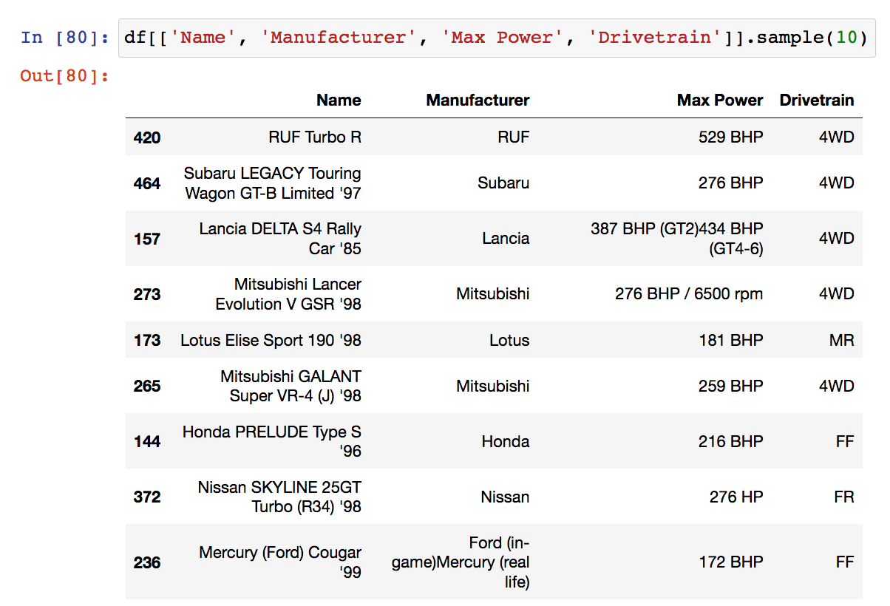
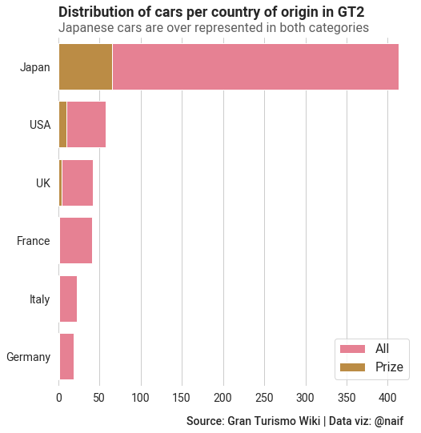

# Gran Turismo Scrape

Utilities to scrape and analyze data about Gran Turismo 2.

My intent was to visualize some of the things I noticed in the game:
* large skew towards Japanese cars (both in terms of total cars, and prize cars)
* large skew towards 90's cars

Both of these properties are not to be unexpected coming from a Japanese
game development company in 99, yet I still wanted to show it through data.

## Peek at data

Table with all car information available [in GT2 Wiki](https://gran-turismo.fandom.com/wiki/Gran_Turismo_2/Car_List)



Plot showing the distribution of all cars, and also prize cars, per manufacturing
country (see `gt/clean.py` to see how to clean the information to be able to plot this):




## Download data

Currently hosting scraped data on Dropbox:
* 2020-09-12 V1: [dropbox download](https://www.dropbox.com/sh/7s1ot25vp3keozi/AACOgNtRYVBSs0whvyXedSbLa?dl=0)


## Installation instructions

Assuming you use [conda](https://docs.conda.io/projects/conda/en/latest/user-guide/install/),
and create a conda environment called `gt`:

```bash
conda create --name gt python=3.6
conda install -c conda-forge --file requirements.txt
```

## Notes

* I used [`jupytext`](https://jupytext.readthedocs.io/en/latest/introduction.html) to convert my jupyter notebook to `.py` file, this is very
convenient as it is way more git friendly / allows much easier version control.
* I learned scraping from [the following blog post](https://realpython.com/beautiful-soup-web-scraper-python/#reader-comments) introducing to beautiful soup.
